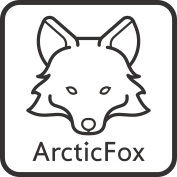

|pcbBadge|
|protoBadge|
|firmwareBadge|

************
Introduction
************

Overview
========

Arctic is an STM32F072-based universal 60% keyboard PCB featuring limited layouts and features. The layouts were cherry-picked by enthusiast ArcticFox and consist of only Tsangan bottom row.

This PCB also features "relief" flex cuts aimed at improving keyboard typing feeling.

ArcticPCB holds a very special place in my heart as it was one of the first two PCBs in AcheronProject and effectively inaugurated it.

The PCB files can be found at the `ArcticPCB GitHub repository <http://github.com/Gondolindrim/ArcticPCB>`_ . 

Contributors
============

- Raphael "ArcticFox" Hochheim for helping choosing the compatible layouts
- Felipe "MrKeebs" Coury who paid for the V1 prototypes and helped immensely by funding my learning
- PCBWay for sponsoring the pre-revision Alpha prototypes

Supported layouts
=================

Click `this link <http://www.keyboard-layout-editor.com/#/gists/02cdf0355423143cec9d6a2a934cfddf>`_ for the KLE file for the ArcticPCB. The picture below shows that KLE.

.. figure:: https://raw.githubusercontent.com/Gondolindrim/ArcticPCB/master/graphics/KLE/arcticKLE.png
        :align: center
        :width: 800px

Renders
=======

Click at the images to zoom in. Renders were generated by the `tracespace.io <https://tracespace.io/view/>`_ site.

.. figure:: https://raw.githubusercontent.com/Gondolindrim/ArcticPCB/master/graphics/renders/bottomRender.png
        :align: center
        :width: 800px

.. figure:: https://raw.githubusercontent.com/Gondolindrim/ArcticPCB/master/graphics/renders/topRender.png
        :align: center
        :width: 800px

PCBWay sponsorship
==================

.. figure:: https://s3-eu-west-1.amazonaws.com/tpd/logos/54695d4a00006400057b939d/0x0.png
        :align: center
        :width: 200px

The pre-revision Alpha of the ArcticPCB was sponsored by `PCBWay <http://www.pcbway.com>`_, a big asian PCB manufacturer that provided prototypes for the Arctic.

The review article can be found at `the AcheronDocs page <https://gondolindrim.github.io/AcheronDocs/pcbway/sponsorship.html>`_.

Logo
====

The Fox icon was based on `this design <https://www.flaticon.com/free-icon/fox_112476>`_ and slightly modified.

Features
========

The ArcticPCB is an open-source keyboard PCB featuring limited layouts and compatibility. It also features "universal 60%" mounting holes. Here's a list of the board's features:

- ARM Cortex M4-based STM32F072 processor;

- QMK firmware compatible;

- USBC type connector;

- Single layout support: Tsangan bottom row. Also features split right shift, split backspace and stepped caps lock.

- Hardware reset through a push button and reset network;

- Overcurrent and overvoltage input protection through a fuse and schottky diode;

- Electrical Static Discharge (ESD) protection on the USB data lines;

- Surge protection from the metallic case contact.

The idea to make an Open-Source Hardware compliant board was that it could be widely customizable from the start, so anyone could take an ArcticPCB, give their thoughts, feedback and even modify it to their liking. It was designed for that purpose.

In that sense, the Shark uses an STM32 microprocessor that can be programmed in many ways, be it through the QMK firmware, Arduino IDE or any ensemble of software able to flash an STM32.

Also, following the customizable principle, all unused pins were exposed so that the user can add anything hardware-wise he or she wishes.

.. |pcbBadge| image:: https://img.shields.io/badge/PCB%20Version-%20Alpha-red.svg?style=flat
.. |protoBadge| image:: https://img.shields.io/badge/Prototype%20Version-pre%20Alpha-green.svg?style=flat
.. |firmwareBadge| image:: https://img.shields.io/badge/Firmware-Passing%20for%20pre%20Alpha-green.svg?style=flat
