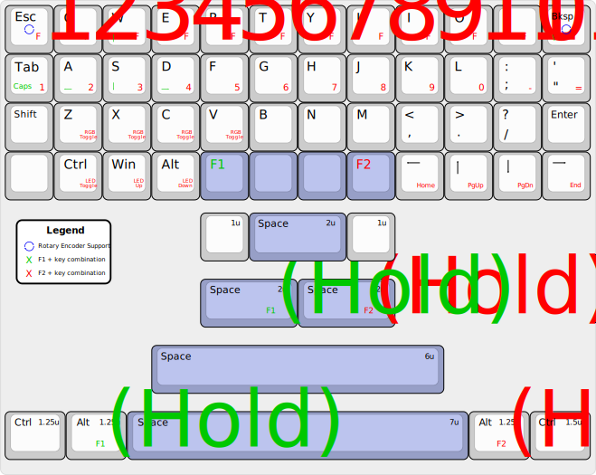

  
  
  

# SharkPCB

<figure>
  
</figure>

---

## Introduction

### Overview

The SharkPCB was conceived as an alternative 40% ortho keyboard that could be easily built and sold in difficult-to-reach markets like Brazil. 

In 2016, when I was already some years into the Mechanical Keyboard hobby, I wanted to try a 40% ortho layout. Unfortunately none were available in the Brazilian market; the Planck was (and still is) pretty much the only option in the market when it comes to that layout, and it was only available in the US market and EU through Massdrop. However, due to the proxy prices, PayPal fees and importing taxes, I would not be able to get a Planck since I simply did not have the money. So I set myself to design a keyboard that I could easily build and customize. My idea was to use a Blue Pill breakout board, using simple THT components for diodes and resistors.

In the next weeks, Steve from WoodCables came along and funded the project. We made a little revision of the design plan as a default SMD-component based PCB was needed to compete on the market. And thus Shark was born.

In 2022, a revision was requested for a second Group Buy in Brazil; this prompted the revision of the PCB and release of revision Beta, which uses much, much more sophisticated techniques that I had acquired from the years developing keyboard PCBs.

The name comes from a dear friend of mine, Gustavo, who at the time did not have a nickname. I suggested the nickname "Shark" because he used a shark image for his avatar; after much thinking, he decided to adopt the Undecided Shark alias, from whence the Shark PCB was named.

## Contributors

- Steve from WoodCables, who funded de project and made it grow bigger than I had never imagined;
- Alan Pocklington, also known as u/ajp10304, who built a prototype himself and offered to test the preliminary software to hasten the GB and gave immense feedback on documentation and component positioning.

## Availability

Any one can manufacture and sell SharkPCBs using the [release Beta manufacturing files](https://github.com/AcheronProject/SharkPCB/releases/tag/beta-rc1).

Before selling PCBs, please read the Acheron Open-Source Hardware License v1.4 under which Shark is released.

## Features

The SharkPCB is a freely available, open-source 40% keyboard Printed Circuit Board (PCB) supporting three layouts: full grid, 1x2U spacebar and 2x2U spacebar. All resources and software used to design this board are open-source and/or freely available. The latest revision, Beta, features:

- 40% ortho layout with 19.00mm switch spacing;

- A multi-STM32 MCU compliant topology known as the [Joker topology](http://acheronproject.com/joker_mcus/joker/);

- QMK/VIA firmware compatible;

- USBC type connector;

- RGB underglow through intelligent integrated controller WS2812C-2020 LEDs;

- Three layout support: full-grid (FG), 1 centered spacebar (1S) and double spacebar (2S);

- Rotary encoder support;

- Hardware reset through a push button and reset network;

- Overcurrent and overvoltage input protection through a fuse and schottky diode;

- Electrical Static Discharge (ESD) protection through a discharge net.

Additionally, plate gerber files are also available so that the user can order them made from the same manufacturer as the PCBs and out of the same material (FR4, a fiberglass enhanced resin laminate). This makes production cheaper and faster.

There are four plate designs available: one for each supported layout and a universal one that supports all three of them.

The idea to make a Open-Sourcea Hardware compliant board was that it could be widely customizable from the start, so anyone could take a SharkPCB, give their thoughts, feedback and even modify it to their liking. It was designed for that purpose.

In that sense, the Shark uses an STM32 microprocessor that can be programmed in many ways, be it through the QMK firmware, Arduino IDE or any ensemble of software able to flash an STM32.

Also, following the customizable principle, all unused pins were exposed so that the user can add anything hardware-wise he or she wishes.

## Compatible layouts

<figure>
  
</figure>

## Revision Beta pictures

<figure>
  
</figure>

<figure>
  
</figure>

## Acknowledgements

**Steven** from WoodCables. Steve funded the prototypes, is currently running the GB, talked to PCB and case factories. More than this, he gave inumerous design hints and was a part of the design. Without him the Shark would not be possible.

**Gustavo "Undecided Shark" Reinert** was an active part in the design process and named the PCB. I take special pride in this as I gave him his nickname.

**Felipe "MrKeebs" Coury**, the guy whose will to help is second only to his will to spend money on keyboards and stream himself while doing it.

**Raphael "ArcticFox" Hochheim**. The most high-end guy out there, always giving hints and thoughts. The Shark logo positioning and the case format were heavily based on his experience.

**garbo** from GeekHack, who helped immensely in this design by giving me hints and information, always opinating and giving feedback with christian patience. The idea for the mounting hole points were his.

**Walkerstop** also from Geekhack helped by recommendations like using the STM32 family of processors and a USBC connector.

**u/ajp10304** from Reddit. Now this guy read the README and the documentation thoroughly and pointed inconsistencies and errors several times. He gave me good reasons to make a nice documentation and he helped me immensely by this. He also prototyped the Shark in the blue color and was gracious to let me publish the pictures;

**Jack Humbert**, from OLKB, and **ishtob** from the QMK Discord Server. Jack was always very amicable and helpful; the 3D CAD files for the Planck Cases and plate came from the QMK parts Git repo. ishtob was always very accessible and helping with some design questions; in fact, some of the footprints and symbols used were based off of some of his own.

Many people in the Discord server helped with hints, specially **yanfali, Upas** and **MechMerlin**.
