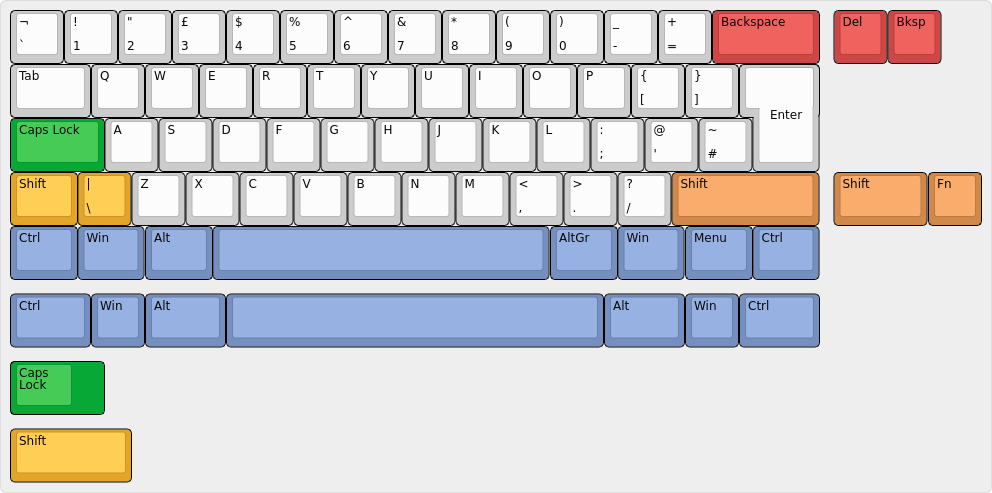
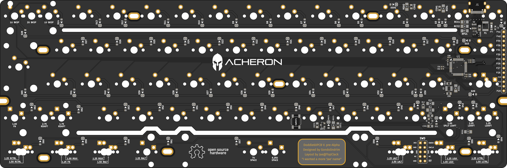
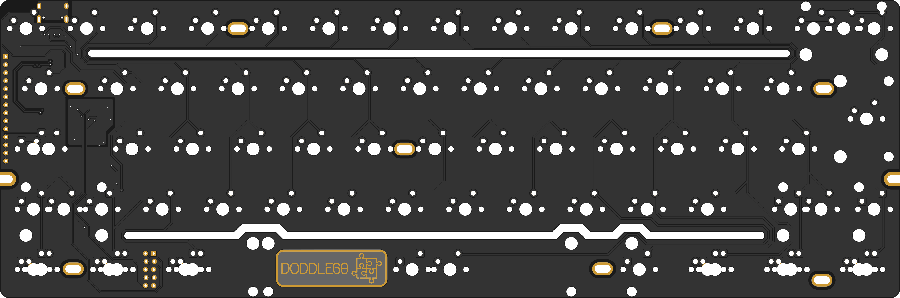

|pcbBadge|
|protoBadge|
|firmwareBadge|

.. figure:: ../images/doddle60/doddle60Logo.svg
        :align: center
        :width: 600px

************
Introduction
************

Overview
========

**Doddle**. British slang for something easily accomplished.

Nowadays there is a big space in the hobby for what has been called "plain-style" PCBs, such as Maarten's Plain-C and Upas's AN60-C, which most common characteristic is the limited layout compatibility and features, in order to make an easy-to-build PCB.

Unfortunately only ANSI versions are available as ISO layouts are often discarded for the little parcentage of the hobby it represents; because of that, I have been receiving many requests from our fellow european clackers to make a plain ISO 60% PCB. Some weeks ago I reached out to Jae, from TopClack, who is an open advocate of ISO compatibility, and he suggested the compatible layouts.

Contributors
============

- Jae from TopClack, who helped immensely at the design stage, choosing the layouts and doing the EU distribution (even covering shipping expenses);
- All the backers from the IC page, who showed interest and backed the early prototypes.

Supported layouts
=================

Click `this link <http://www.keyboard-layout-editor.com/#/gists/dfb069e34f7b14d63b03305a79dfc469>`_ for the KLE file for the Doddle60PCB.

Renders
=======

Click at the images to zoom in.

Renders generated by the `tracespace.io <https://tracespace.io/view/>`_ site.

Features
========

The Doddle60 is a plain-style, limited compatibility 60% keyboard PCB designed to be compatible with "poker-style" universal mounting points. Despite the PCB's simple nature, it has quite a handful of features:

- Flex ("release") cuts;
- USBC connector;
- ESD protection on data lines;
- TVS (Transient Voltage Suppression) on power lines, protecting the PCB from voltage spikes;
- Full digital power rails isolation and filtering, stabilizing MCU voltage and avoiding power bugs;
- Data lines differential pair impedance matching through differential-coupled ferrite core choke;
- Cable shield discharge protection;
- Overvoltage and overcurrent protection;
- Current inrush protection from metallic cases;
- ARM STM32F072 processor; all unused pins are broken out so that the user can expand the PCB in any way;
- Universal screw holes "Poker 60%" format, making it compatible with most 60% cases;
- First backers will get a version in which "pre-Alpha revision" is expressly written.

.. |pcbBadge| image:: https://img.shields.io/badge/PCB%20Version-Release%20Alpha-blue.svg?style=flat
.. |protoBadge| image:: https://img.shields.io/badge/Prototype%20Version-pre%20Release%20Alpha-orange.svg?style=flat
.. |firmwareBadge| image:: https://img.shields.io/badge/Firmware-Not%20Available-gray.svg?style=flat
