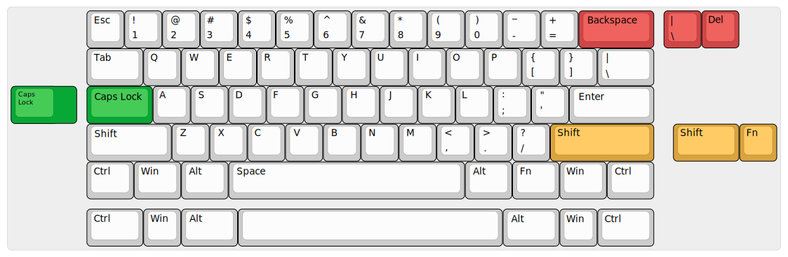

|pcbBadge|
|protoBadge|
|firmwareBadge|

************************************
Introduction: a PCB to rule them all
************************************

(Sindárin, Gnomish) **Lasgweloth (n)**. *Leaf-fading; autumn. It is said to describe the feeling of leaves fading and falling in the middle of the fifth week of the elven year. (Source: "A Gateway to Sindarin: A Grammar of an Elvish Language" and "The Etymologies")*. Pronounce: "les-gweh-loth".

Lasgweloth is an STM32F072-based universal 60% keyboard PCB presenting limited layouts and features, much like the ArcticPCB and the KeebsPCB. Also alike ArcticPCB was the signature PCB of The Arctic Fox and KeebsPCB the signature PCB of Mister Keebs, Lasgweloth is my signature PCB; it features the new experimental "leaf-spring tray-mounted springs". This new system aims at reducing the shortcomings of tray-mounted keyboards, *videlicet* bad sound and stiffness.

- The bad sound in tray mount keyboards stems mainly from the fact that the uneven pressure of the screws promote an uneven sound distribution and propagation across the case material;
- The stiffness of tray mount plates, which kills the flex, is due to the solid mounting points that the screws offer.

For these reasons, tray-mount keyboards are known to be less premium than their other mount technologies. The critical part is that, due to their simplicity, tray-mount keyboards generally figure among the best cost-to-benefit products on the market (lest look at the TOFU and the TADA68 keyboards). This is due various facts, the main ones being that tray mount cases can be made from a single machined metal piece, whereas more sophisticated mounts generally need two or more pieces. Even then, there also are high-end keyboards around, like Mechanisk's Klippe and Fjell. So the Lasgweloth is an attempt to make these keyboards feel and sound better, even if ever so slightly,

This PCB also features "relief" flex cuts aimed at improving keyboard typing feeling.

The leaf-spring tray mounting system
====================================

Now that is a mouthful, isn't it? I came up with this idea when taking a look at the leaf-spring mounted keyboards and noticing how that mounting system promotes the fleXXX we want and need. The idea there is simple: isolating mechanical vibrations inside the plate medium and isolate them from the keyboard case, so they don't propagate through the keyboard case. It also reduces the stiffnes of the plate and makes the sound concise.

The idea here is the same. We all know tray-mounts are not ideal because the uneven pressure from the screws on the PCB or plate makes the sound and pressure distribute unevenly; that destroys fleXXX and the sound. My idea is then to use the leaf-spring idea to isolate sound and make the PCB fleXXXier.

What I did was, understanding that the propagation of sound is basically the travelling of mechanical waves through a medium, there are particular shapes which can promote destructive interactions from the wave with its reflexions; that means that we can cut certain shapes in the PCB that concentrate sound in the screw centers and do not let that sound propagate from the PCB to the case.

The shapes I came up with are illustrated in the next figures. They show the mounting screw holes of the PCB, isolated by "leaf-spring" shapes that aim to sonically isolate the screws from the rest of the PCB; also, they concentrade stress on the necks, making them fleXXXier. The particular shape was determined through numerical simulation in SolidWorkds of the propagating sound through the PCB, using normal values of medium characteristics for FR4. This was then used to determine the "neck shapes" needed to promote destructive iteration of sound.

	.. figure:: ../images/lasgweloth/cutouts.svg
		:align: center
		:width: 1200px

Supported layouts
=================

Click `this link <http://www.keyboard-layout-editor.com/#/gists/044b01bb6c6aca4c3ee7ae859e22167e>`_ for the KLE file for the Lasgweloth.

Renders
=======

Click at the images to zoom in.

Renders generated by the `tracespace.io <https://tracespace.io/view/>`_ site.

.. figure:: ../images/lasgweloth/top.svg
        :align: center
        :width: 1000px

How to obtain
=============

The Lasgweloth is, as of July 18 of 2020, still in prototyping stages and is not released yet. The only way to obtain one was through the `Limited Group Buy page <https://geekhack.org/index.php?topic=105867>`_. 

.. |pcbBadge| image:: https://img.shields.io/badge/PCB%20Version-Not%20available-inactive.svg?style=flat
.. |protoBadge| image:: https://img.shields.io/badge/Prototype%20Version-Not%20available-inactive.svg?style=flat
.. |firmwareBadge| image:: https://img.shields.io/badge/Firmware-Not%20available-inactive.svg?style=flat
