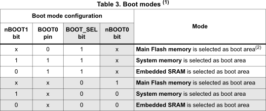
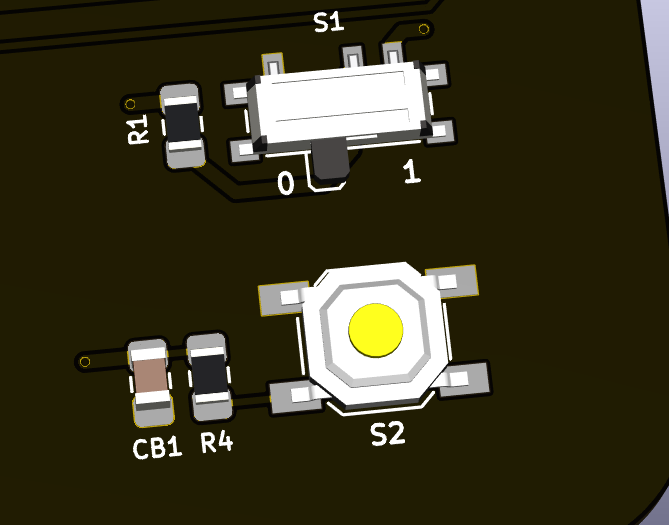
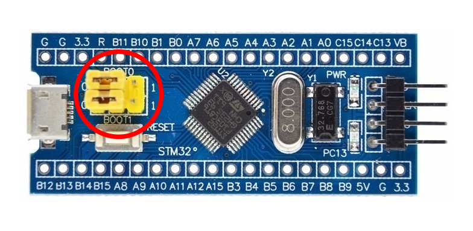
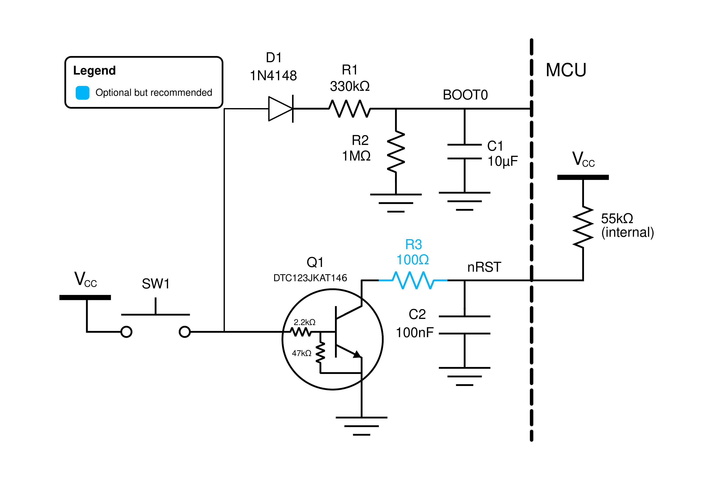
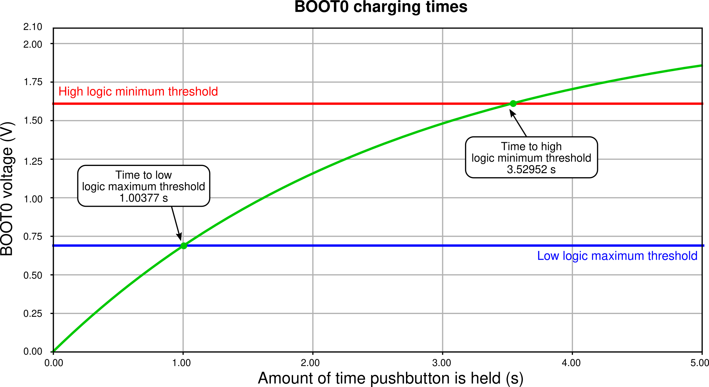
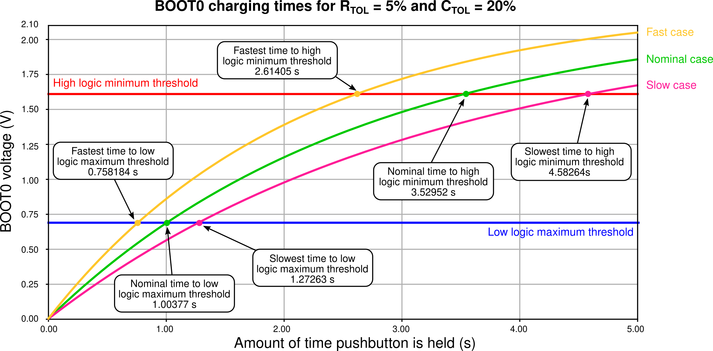
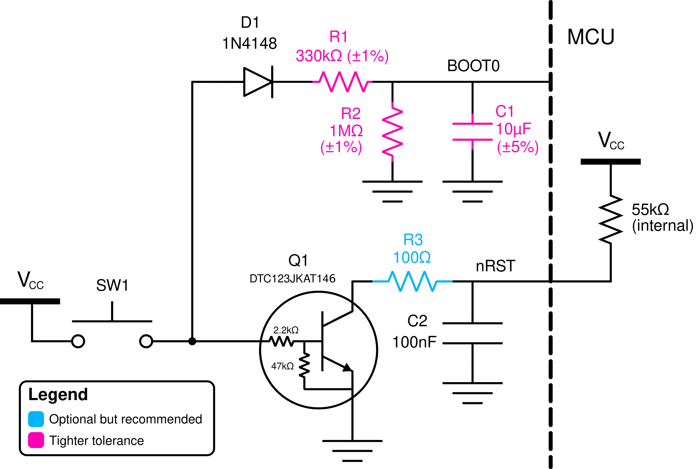
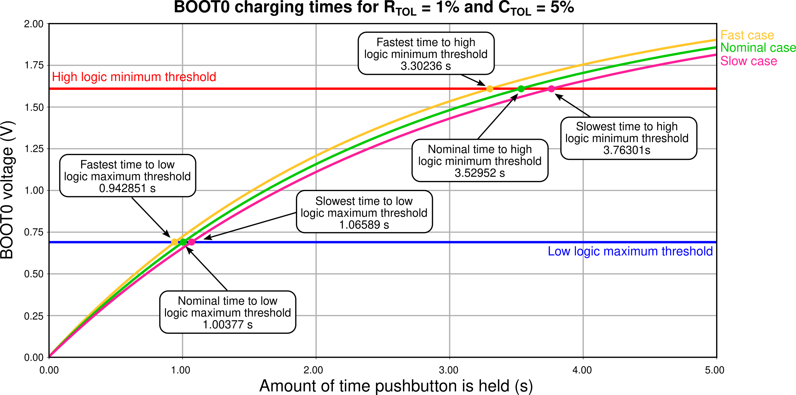
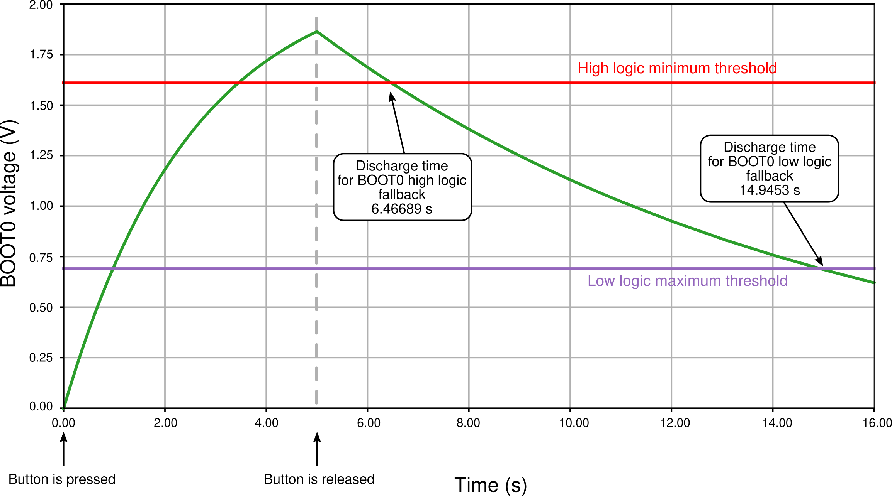
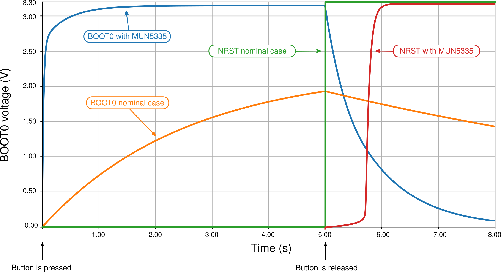

*************************************
A single-push reset circuit for STM32
*************************************

The STM32 family of microcontrollers offers a wide good variety of options when it comes to boot selection. The majority of STM32 devices are flashed at factory with a bootloader that is very permissive and complete; it allows for a wide variety of options when it comes to booting options, boot behaviors, in-system programming through I2C, SPI, serial communication and very good debug features.

One of the most interesting aspects of working with these devices is the way STM tackled the boot selection process, that is, what portion of the memory is used for the stack pointer start. In STM32F0xx devices, there are basically four ways you can boot the MCU: main flash memory, main system memory, embedded SRAM memory, and an "empty check" option only available to STM32F04x and STM32F09x devices.

Despite this page being written for the STM32F072 MCU that I use mainly in my boards, the principles, calculations and simulations are very device-agnostic in the sense that they should work for any STM32F0xx device with some mild adaptation or none at all.

In this article I will detail the many possibilities there are for handling these boot options, and the design of a reset circuit that can reset the MCU simply or drive it to bootloader, using a single push button.

(1) Introduction
================

Embedded Engineering is fairly complicated shenanigans. It involved dominating technologies and procedures so complex that they need higher education to be fully mastered, and then make those very same technologies and procedures available and accessible to the general public which is very unkowledgeable about technology. Customers generally want a very simple solution to a very complex problem and, sometimes, the best product does not always win if it is not user-friendly -- Apple products being the master example for me, being much less powerful than the competitors in the same price range but light-years ahead in terms of user experience and usability.

One of such problems is handling the reset event in an MCU. A microcontroller generally has several memory options, all of which can be invoked, operated, written and erased at runtime and all of which containing their particular use and place. From and end user's perspective, *we want it to just work*, but that's not how it goes in research and development. R&D is a very nonlinear process that requires full mastery of the system being worked on, which is again completely incompatible with user experience due to the general unkowledgeability of the end user.

With the recent addition of ARM processor support to QMK -- STM32F103, STM32F072 and STM32F303 -- the issue of MCU boot select and how to make it accessible to the end consumer is not yet well understood by the PCB designers of the Custom Mechanical Keyboard community. When ATMEGA processors are concerned, there are very clear and standardized ways we deal with the reset problem.

In this article I will detail the three possibilities we have to handle that problem in STM32 MCUs; each of the three ways have their pros and cons and, just like almost everything in PCB development, design choices have to be made.

(1.1) But what exactly is the problem?
--------------------------------------

Of course, no one develops a solution in search of a problem. So, first of all, before tackling hardware and firmware specifics, we need to state **"What exactly is the problem?"** and work from there.

The problem is twofold. First, the STM32 MCUs have several boot options and we need to know which ones does what, so that we can limit those options to the ones the end user will effectively use, and how to access them individually. Second, we need to minimize user interaction to such a degree that designers are comfortable knowing the end user can operate the product with zero knowledge about how it works.

In STM32 MCUs, the user will basically use two boot regions. The first is the **main system memory**, which starts at address 0x1FFF in STM32F07x devices (see the Reference Manual [1]_ on section 6.3.14 for the addresses of the other devices in the family). The main system memory contains the bootloader program that is flashed by STM at the factory. One of the main reasons for the adoption of the STM32F072/071 devices is the USB DFU capability of their bootloader, that is, the possibility of upgrading the flash program memory from the USB communication. Devices without this capability need a dedicated communication, called In-System Programming or Serial Wire Debug for STM (SWD for short), to have their flash memory upgraded. This boot option is used when the user want to re-flash their keyboard, which is not often but still needed very seldomly.

The second boot region that the end user willl need is the **main flash memory**, located at 0x08000000, where the operating firmware like QMK is to be flashed. Resetting the MCU into this are is what you would expect from the word *reset*. It stops execution and re-starts it from the beggining of the program, which can be needed in many cases such as if the keyboard firmware has stopped due to a bug or if the keyboard is simply showing erratic behavior, or after flashing the keyboard.

Booting from SRAM or the empty check are primarily development options which the end user will much, much rarely use.

The problem then becomes: **how to develop a user-friendly way to make available the flash memory and system memory choices into an end product, which requires minimal knowledge about the system's intricacies and can still be reliable enough?**

(1.2) How boot selection works on STM32F0xx
-------------------------------------------

The way we select the boot region in STM32 devices are through external pins and certain registers. In STM32F0xx devices, there are two external pins, **nRST** and **BOOT0**, and two memory registers **nBOOT1** and **nBOOT0**. **nRST** is the hardware reboot pin: when this pin is pulled low, all but some registers in the MCU are reset. When it gets back to normal high the MCU starts from memory address 0x00000000 and the bootloader program takes over. At the fourth rising edge of the system clock the **BOOT0**, **nBOOT0** and **nBOOT1** values are sampled and the boot option is determined according to the table :numref:`reset_table` below.

.. _reset_table :

	. Table of boot options for STM32F0xx devices.

First of all, we can ignore the three bottom options as those are only available to STM32F04x and STM32F09x devices. Then for the three top options, we can ignore **BOOT_SEL** that is 1 for all these options and **nBOOT0** which is marked as an **x** meaning its value does not matter for these options. As for **nBOOT1**, we have to remember it comes factory-set as zero, meaning that if we simply don't mess with it, we can do both the options we wanted -- boot from system memory or boot from flash -- at the expense of not being able to start from SRAM which is very, very rare on an end-product occasion so not a big deal anyways.

In the end, we can reset into flash or go into DFU USB by only setting the value of the pin **BOOT0**: if it is high, the MCU goes into DFU and if it is low, it resets into flash.

(1.3) The vanilla reset circuit
-------------------------------

Hence, the reset circuitry we will use is very simple. It has only two interactions required from the user: setting BOOT0 to either low or high logic levels and pressing a button to trigger the hardware reset process through pin nRST.

Reference [2]_ in page 30 shows a very simple yet effective way to achieve this in the reference design. This vanilla circuit is depicted in figure :numref:`vanilla_reset` .

.. _vanilla_reset :

	. Vanilla reset circuit recommended by ST in [2]_.

This circuit is very simple and only needs a couple components. The pulling of nRST is done by a simple push button and a capacitor to avoid weird transients; the BOOT0 selection is done by a selector switch. In some custom keyboards like `the Sagittarius <https://geekhack.org/index.php?topic=107023>`_, this employs an SPDT switch:

.. _sagittarius_reset :

	. Implementation of the vanilla reset circuit using an SPDT switch.

On these boards, to flash the MCU, the user changes the SPDT to position one and presses the push button, forcing the MCU to DFU. After the MCU is flashed, the user changes the SPDT back to the 0 position and presses the button again. 

On BluePill boards, this is done through a simple jumper selector.

.. _bluepill_reset :

	. Implementation of the vanilla reset circuit using a jumper selector in BluePill featherboards.

The vanilla circuit of :numref:`vanilla_reset` can be modified just a little bit to make it more reliable, by addding a 100R resistor in series with the nRST button to avoid fast voltage changes in its capacitor and adding a little 100n capacitor to BOOT0 to avoid any fast transients, since it is a CMOS-type input.

.. _vanilla_reset_gondo :

	. Slight modification from the vanilla reset circuit recommended by ST.

The problem of this vanilla circuit is that it requires way too many operations from the user. Turn SPDT to high, push button, flash, turn SPDT back to low, push button again. This can confuse some people and, ultimately, can make the flashing experience hard for people not tech-savvy.

(2) A new reset circuit
=======================

In middle development of the SharkPCB, a user by the name of ishtob (can't find his GitHub account or his Discord anymore, please contact me so I can credit you properly ish!) blessed me with a piece of his knowledge and shared a reset circuit he was working on. A version of this circuit is depicted in :numref:`reset1`.

.. _reset1 :

	. ishtob's original reset circuit for STM32.

The circuit is pretty clever; the idea is that the user will need to interact with the PCB only once to get it to work. When the push button is presset, the transistor will drive nRST to ground immediately; the reset and capacitor by BOOT0 will store voltage. By the time the user lets go of the button, BOOT0 is charged up and nRST is low. The MCU then goes into bootloader mode.

There are two caveats with this circuit. The first is that the diode is absolutely needed; without it, the charged voltage across the BOOT0 capacitor can maintain the transistor conducting and the MCU will not reset before BOOT0 loses its voltage to resistor decay. The second is that the transistor used has to have a base resistor, or else the base and emitter will be shorted -- a bipolar transistor is basically two diodes back-to-back -- and the circuit will never work; using a pre-biased transistor (also known as digital transistor) like the DTC123JK helps to keep component count lower due to the integrated resistors.

One might point out that this circuit only does half the job -- it is able to get the MCU into DFU, but not able to reset the program. Well, as it turns out, resetting the MCU is not needed *per se*. See, QMK has software reset capabilities, so once the MCU is flashed it automatically resets. The user is also able to reset the MCU through a key combination, making use of the Boot Magic features of QMK.

The circuit works wonders. It is fairly simple, does the job and requires few components; revisions Alpha of the SharkPCB and ArcticPCB use it. Still, it is not good practice to rely solely on software reset and, as it turns out, it can be pretty catastrophic because locking the hardware reset can brick the MCU by getting it into a buggy state where software reset does not respond.

(2.1) Improving over ishtob's circuit
-------------------------------------

In order to add a reset-and-DFU capability to the circuit, I had to turn my eyes to the BOOT0 branch. The nRST branch was pretty much figured out, so what I had to do was invent a way to modulate wether BOOT0 will be low or high at the time instant the user releases the push button, which is when nRST gets back to one and the BOOT0 pin is sampled and the boot option decided.

What I did was simple, yet complex. The addittion of a resistor between the diode and the BOOT0 branch will enable the RC circuit of BOOT0 to act as a timed charge RC circuit which voltage rises across time as the push button is maintained pressed.

.. _reset2 :

	.Improvement over ishtob's original reset circuit.

Hence, the idea here is that the MCU boot option will be determined by how much time the user keeps the push button pressed. If for a short amount of time, the BOOT0 RC circuit will not have time to charge up enough to be considered high and the MCU will simply reset. If the button is held long enough, then BOOT0 will charge enough voltage to be considered high and the MCU will enter DFU.

The form and charge/decay rates of the BOOT0 pin are given by the R1, R2 and C1 components. The bigger the R2 over R1 proportion, the faster the circuit charges and the bigger will be the steady-state voltage. The higher the capacitance, the slower the voltage charges. The challenge then becomes to finely tune the values so that the times needed are convenient. For instance, if the charge is too fast, the user will not be able to press and release the circuit fast enough to reset it, and the MCU will always bootload. If the charge is too slow, then the user will need to keep the button pressed for too long a time.

To determine the exact times, first we need to know the logig level thresholds of the BOOT0 pin. In the MCU datasheet [3]_ one can see the following table:

.. _thresholds_table :

	.Datasheet table of minimum and maximum voltage logic level thresholds.

The table shows that using a feeding voltage of 3.3b,  BOOT0 is considered low for voltages lower than :math:`0.3\times 3.3 - 0.3 = 0.69V` and high for voltages higher than :math:`0.2\times 3.3 + 0.95 = 1.61V`. The circuit of :numref:`reset2` was simulated usin LTSpice XVII; the simulation results are detailed below.

.. _reset2_simulation :

	.Time simulation of the circuit in :numref:`reset2`.

The simulation shows that as the button is kept pressed, the voltage of BOOT0 crosses the low logic level maximum threshold at approximately 1 second and the high logic level minimum threshold at approximately 3.5 seconds. In other words, if the button is kept pressed for shorter than a second, the MCU will reset and, if kept pressed more then 3.5 seconds, the MCU will enter DFU mode. There is no telling what happens in between the 1s and 3.5s, as the logic level interpretation is not certain in that voltage zone.

(2.2) Considering components tolerances
---------------------------------------

There is, however, an inherent flaw wih the design of the :numref:`reset2` circuit: the components used have tolerances which have to be accounted for; since these tolerances are considerable, the press timings will change with the real component values.

Let us define that the resistors have a 5% tolerance and capacitors have a 20% tolerance. First of all, since the nRST branch of the circuit is just pulling nRST to the ground and very fast, there is not much analysis to do with component tolerances here. The real problem lies with the RC charginf circuit of BOOT0.

Consider then the three comparison cases:

- (1) Nominal case. All components are at their nominal values;
- (2) "Slow" case. C1 and R1 are at their highest possible value of 120µF and 34.65kΩ and R2 is at its lowest of 95kΩ; hence this variation is the one that takes the longest to charge;
- (3) "Fast" case. Pretty much the opposite of the slow case: C1 and R1 are at the lowest values 80µF and 31.35kΩ and R1 is at its highest 105kΩ, which is the fastest charging possible variation.

.. _reset2_simulation_variance :

	.Time simulation of the circuit in :numref:`reset2` considering component tolerance-added "slow" and "fast" cases.

:numref:`reset2_simulation_variance` shows the simulation of the three cases. The simulations show that the fastest time the circuit will cross the low logic levle maximum threshold is at approximately 0.75s, while the longest time the circuit will take to cross the high logic level minimum voltage is approximately 4.5 seconds. This means that by using the circuit of :numref:`reset2`, if the user presses the button for no more than 0.75 seconds the MCU is guaranteed to reset, and if he or she presses the button for longer than 4.5 seconds the MCU is guaranteed to DFU.

These times are, however, not to my liking. As can be seen in :numref:`reset2_simulation_variance`, the spread of timings between the curves is way too high. In order to solve that, I changed the tolerances of the resistors to 1% and the tolerance of the capacitor to 5%. 

.. _reset2_tight :

	.Improved reset circuit with tighter tolerances.

:numref:`reset2_simulation_variance_tight` shows the simulation of the same circuit with the tighter tolerances, which is much, much better: now the needed times for guaranteed low and high levels are 0.94 seconds (which can be considered 1s for a human reaction time) and 3.8 seconds.

.. _reset2_simulation_variance_tight :

	.Time simulation of the circuit in :numref:`reset2_tight` which has tighter component tolerances.

The choice of tighter or normal components is really a designer choice, but I highly recommend the use of this tighter circuit since the price raise is really not much (maybe a dollar?) and the circuit becomes much, much more reliable.

(3) Handling the discharge issue
================================

The circuit of :numref:`reset2` still has an issue: the discharge of the BOOT0 circuit. The charging of the circuit sure does serve our purpose, but what happens *after* the MCU has reset or entered DFU mode? Of course, the BOOT0 circuit discharges -- the energy charged in the C1 capacitor makes its way to ground with R2. However, the discharge rate of this circuit is way too slow.

:numref:`discharge_simulation` shows thhe simulation of the reset circuit during and after the push button is pressed. This simulation shows that, after the button is released, the BOOT0 takes 10 seconds to fall back to the low logic level threshold. Picture the following situation: the user holds the button and gets the MCU into DFU mode, only to realize that that was not the intention, they wanted really only to reset the circuit. Well, now they give the button a fast press and, surprise: the MCU still goes to DFU when the user didnt hold the button. Since the BOOT0 pin was charged, they must now wait 20 seconds to press again.

A vendor might see the disaster this situation can become: the user now thinks they have a faulty PCB and proceed to rage on the vendor website about how the PCB does not work as intended and they want a refund. 

.. _discharge_simulation :

	.Simulation of the reset circuit of :numref:`reset2` during and after the pushbutton is pressed.

In order to fast discharge the BOOT0 pin, an additional PNP transistor is used, generating the circuit in :numref:`reset3` . The use of the MUN5335DW1T1G integrated circuit makes it possible to integrate both the pre-biased NPN transistor for the nRST pin as well as the PNP transistor for the BOOT0 discharge in the same SOT-23-6 package, keeping component count the same as the old circuit without the discharge.

.. _reset3 :

	.Yet another improvement over the reset circuit, this time with a discharge transistor to ensure voltage fallback discharge.

.. _reset5 :

	.Yet another improvement over the reset circuit, this time with a discharge transistor to ensure voltage fallback discharge.

The idea here is that when the push button is relased, the PNP transistor will conduct and drive BOOT0 immediately to zero, therefore dis-charging the BOOT0 pin and making it possible to re-activate the circuit.

.. _reset5 :

	.Yet another improvement over the reset circuit, this time with a discharge transistor to ensure voltage fallback discharge.

.. _reset4 :

	.Yet another improvement over the reset circuit, this time with a discharge transistor to ensure voltage fallback discharge.

.. _reset4 :
.. figure:: images/png/reset6.png
        :align: center
        :width: 1000px

	.Yet another improvement over the reset circuit, this time with a discharge transistor to ensure voltage fallback discharge.

References
==========

.. [1] STM32F0x1/STM32F0x2/STM32F0x8 advanced ARM-based 32-bit MCUs series reference manual. Available at `this link <https://www.st.com/resource/en/reference_manual/dm00031936-stm32f0x1stm32f0x2stm32f0x8-advanced-armbased-32bit-mcus-stmicroelectronics.pdf>`_. Last accessed june 22, 2020.

.. [2] Getting started with STM32F0x1/x2/x8 hardware development. Available at `this link <https://www.st.com/resource/en/application_note/dm00051986-getting-started-with-stm32f0x1x2x8-hardware-development-stmicroelectronics.pdf>`_. Last accessed june 22, 2020.

.. [3] STM32F072xB / STM32F072x8 MCUs datasheet. Available at `this link <https://www.st.com/resource/en/datasheet/stm32f072rb.pdf>`_. Last accessed june 22, 2020.
