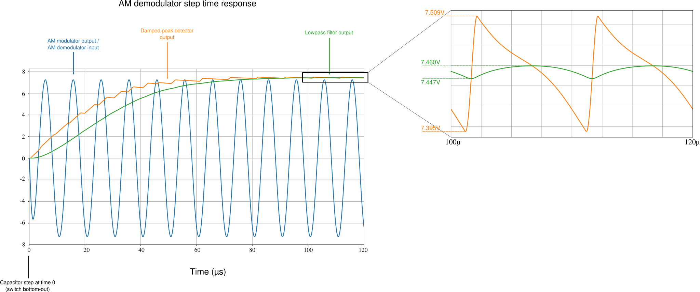
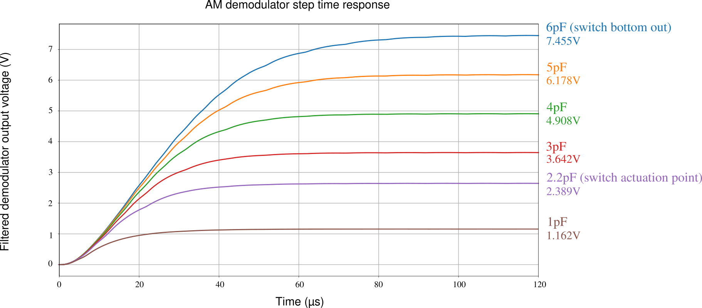
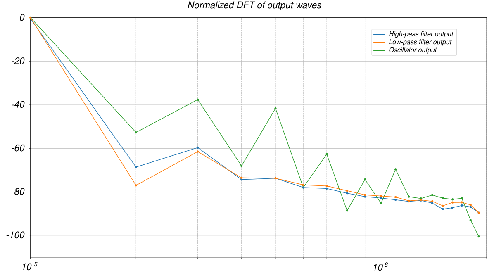

**********************
Principle of operation
**********************

This page describes the operation of the Faraday PCB in the details and inner workings. Some sections use heavily on applied mathematics (differential equations, Laplace transforms, transfer functions) and advanced electronics (high frequency signals, oscillators, filter design, high-speed signals processing). The writing is intended for any enthusiast to look at and understandm but nevertheless some time needs to be taken in order to check the ideas involved.

As always, feel free to contact me for questions.

The page is divided into four sections: the capacitance AM-modulating circuit; the de-modulation circuit; the oscillator circuit and the filters used; and the power supply. Apart from the last section, all of the rest are well-founded with equations and SPICE simulations so they are very close to the real-world  behavior of the systems involved. Frequency and time domain plots are presented to validate the reasoning.

(1) Capacitance sensing circuit
===============================

(1.1) Transfer function and basic mechanism
-------------------------------------------

The heart of the whole system is a capacitance sensing circuit, in the form of a simple op-amp filter:

.. figure:: images/current_sensor.svg
        :align: center
        :width: 400px

In this filter, :math:`C_S` is the test capacitance which will be measured, while :math:`C_F` and :math:`R_F` are fixed, project-determined parameters. This filter circuit has transfer function given by

.. math:: G(s) = \dfrac{V_O(s)}{V_I(s)} = \dfrac{sC_S}{\dfrac{1}{R_F} + sC_F}

For the non-initiated in applied mathematics, this transfer function is a complex-valued function (that is, :math:`s \in \mathbb{C}`) that describes how the output voltage :math:`V_O` changes dynamically according to changes in the input voltage :math:`V_I`. 

Substituting :math:`s = j\omega` (:math:`j` being the imaginary unity that satisfyes :math:`j^2 = -1`) one can deduce the behavior of the system to pure-frequency sinusoidal signals. This means that, if the input signal is a pure-sine wave of frequency :math:`\omega`, the transfer function has an amplitude which is proportional to :math:`C_S`:

.. math:: \left\lvert G(j\omega) \right\rvert = \dfrac{\omega C_S}{\sqrt{\dfrac{1}{R_F^2} + \omega^2C_F^2}}

The main idea is then that, if :math:`V_I(t)` is a perfect sinusoidal wave with frequency :math:`\omega_0`, the output :math:`V_O(t)` will be a sinusoidal wave with frequency :math:`\omega_0` but which amplitude is proportional to :math:`C_S`:

.. math:: \dfrac{\left\lvert V_O(j\omega) \right\rvert}{\left\lvert V_I(j\omega)\right\rvert} = \dfrac{\omega C_S}{\sqrt{\dfrac{1}{R_F^2} + \omega^2C_F^2}} \Rightarrow C_S = \sqrt{\dfrac{1}{\omega^2R_F^2} + C_F^2}\dfrac{\left\lvert V_O(j\omega) \right\rvert}{\left\lvert V_I(j\omega)\right\rvert}

Hence, since :math:`\omega`, :math:`R_F` and :math:`C_F` are known, by measuring the output and input amplitudes one can obtain :math:`C_S`.

It is interesting and important to note that since the amplitude of the output sinusoidal wave will be proportional to the value of :math:`C_S`, then this circuit is actually an Amplitude Modulator which generates an Amplitude Modulated (AM) signal; as such, it is natural to think that after this circuit an AM de-modulator will be needed to complete the capacitance-to-voltage sensor; the frequency at which the carrier wave oscillates will be henceforth called :math:`\omega_0`.

(1.2) Determining filter parameters
-----------------------------------

Before doing any simulations, the parameters :math:`R_F` and :math:`C_F` must be determined. Topre switches cause a capacitance variation from 0 farads (or at least a very low quantity due to stray capacitances) to 6pF when bottomed out; the switch actuates at around 2.2pF. Then, let us adopt as a design parameter that at 6pF the transfer function must have a unitary gain at the carrier frequency :math:`\omega_0`, that is:

.. math:: \left\lvert G(j\omega_0) \right\rvert = 1 = \dfrac{\omega_0 C_S}{\sqrt{\dfrac{1}{R_F^2} + \omega_0^2C_F^2}}

This design requirement is not arbitrary. The main issue associated with analog precision sensing circuitry are the second-order effects that op-amps introduce in the system, the most famous of which is the output saturation due to voltage rails. An operational amplifier will not output a voltage higher than :math:`V_{CC}` nor lower than :math:`V_{SS}`. In practicality, the limits of the output are even tighter; as a rule of thumb, we assume that the op-amp will clamp outputs higher than :math:`V_{CC}-2` and lower than :math:`V_{SS}+2`. While there are op-amps that have output limits very tight to the power rails (called rail-to-rail op-amps), these are generally more expensive and difficult to use than your everyday TL081s. For instance, the figure below shows the maximum output voltage of a TL08x operation amplifier as a function of operating frequency. Note that the maximum acievable output voltages are significantly lower than the power voltages supplied. (Image taken from the `TL08x datasheet <http://www.ti.com/lit/ds/symlink/tl082.pdf>`_).

.. figure:: images/tl082_voltage.svg
        :align: center
        :width: 400px

A value of :math:`V_{CC} = -V_{SS} = 15V` will be used; these voltages are easily generated from the USB power input through precision integrated buck-boost converters as the `TPS61040 <https://lcsc.com/product-detail/DC-DC-Converters_TI-Tex-as-Instruments_TPS61040DBVR_TI-Tex-as-Instruments-TI-TPS61040DBVR_C7722.html>`_ . The input voltage amplitude will be :math:`6.8V` (this value is also not arbitrary and its reason will be seen in the next section), which gives plenty headroom for the op-amps to work with without going into voltage saturation.

There is also the problem of choosing :math:`\omega_0`. This frequency should be in the kHz range, as PCB layout starts to get more and more complicated as MHz-range signals are used due to impedance effects. Also generating such high frequencies is no easy matter for your common solid state oscillators. The frequency of 100kHz was chosen, since it is both easy to generate and this value is very friendly to work with in PCB layouts.

There is also the problem of keyboard input lag. In the first designs, I used the 10kHz frequency, which is very easily generated and can be easily incorporated into PCB designs. The problem with this freqency at the end is that the AM demodulator project got too complicated, as this is a too low of a frequency to carry an AM signal and the AM demodulator dynamics got too slow; hence, the decay and charge times of the demodulator would range in the miliseconds range, which is noticeable. It also needs to be noted that the column and row sweep times of common keyboard firmwares (such as QMK) is generally 1kHz; because of this, having a milisecond-time dynamic for the demodulator will add input lag to the keyboard. 

In the second design, at 100kHz, it is very easy to design an AM demodulator with dynamics fast as to not add significant input lag. Also 100kHz is an easy to generate frequency and also easy to deal with, as most commonplace operational amplifiers can deal with that frequency range.

In this case, one can obtain a relation between :math:`R_F` and :math:`C_F`:

.. math:: 1 = \dfrac{2\pi\times 100\times 10^3\times C_S}{\sqrt{\dfrac{1}{R_F^2} + \left(2\pi\times 100\times 10^3\right)^2C_F^2}}

From here the values must be matched from the feasible resistance and capacitance values and the values the component supplier can provide. Since this is a sensor circuit, the components used must have the lowest tolerances possible. 1% or even 0.5% resistors can be easily found, while low tolerance capacitors are harder to find. In this sense, it is better to first find a capacitor value that is available in a low tolerance and then find a matching resistor. For example, Murata Electronics' GRM0333C1H2R7WA01D is a :math:`2.7pF` resistor with :math:`\pm 0.05pF` tolerance, that is, :math:`\pm 1.85\%` tolerance, which is very good. Using :math:`C_F = 2.7pF` yields :math:`R_F = 297k\Omega`. One can easily use `Uniroyal Electric's 0603WAD3004T5E <https://lcsc.com/product-detail/Chip-Resistor-Surface-Mount_UNI-ROYAL-Uniroyal-Elec-0603WAD3004T5E_C423050.html>`_, which is a 300 kilo-Ohm resistor with 0.5% tolerance. Recalculating the gain at 100kHz yields

.. math:: \left\lvert G(j2\pi\times 100 \times 10^3) \right\rvert = \dfrac{2\pi\times 100\times 10^3 6\times 10^{-12}}{\sqrt{\dfrac{1}{\left(3\times 10^{6}\right)^2} + (2\pi\times 100\times 10^3)^2\left(2.7\times 10^{-12}\right)^2}} = 1.007944041

Which is very close to the intended unitary gain, validating the designed circuit.

(1.3) Dynamic response
----------------------

There is, however, a small problem with the calculations above: they are based on a steady-state analysis of how the amplitude of the output wave changes with respect to the capacitance value. In the realtime, dynamic behaviors exist: upon a change in the measured capacitance, even if that change is instant, the change in the amplitude of the output voltage is not. There is a transient that the amplitude faces before going to its intended value; if that transient is too slow, that means that the circuit takes too much time to register the capacitance change (that is, the circuit take too much time to register a keypress), rendering the keyboard unusable. Because of this, a thorough dynamical simulation of the key actuation and how the circuit behaves is salutar.

Let's use the circuit transfer function to simulate the output response of the circuit. Suppose that the input voltage is a sinusoidal wave with amplitude :math:`A` and :math:`\omega_0` frequency; then its Laplace Transform is given by

.. math:: V_I(t) = A\cos\left(\omega_0 t\right) \Rightarrow V_I(s) = \dfrac{As}{s^2 + \omega_0^2}

For those not familiar with the concept, the Laplace Transform :math:`\mathcal{L}\left\{f\left(t\right)\right\}` is a mathematical transformation that associates a time signal :math:`f\left(t\right)` to a function in the space of complex frequency :math:`s \in \mathbb{C}`, given by

.. math:: F\left(s\right) := \mathcal{L}\left\{f\left(t\right)\right\}(s) = \int\limits_{-\infty}^{\infty} f\left(t\right)e^{-st}dt,\ F:\mathbb{C}\to\mathbb{C}

For Linear-Time-Invariant systems (linear systems that do not change with time, that is, dont "get older"), it can be shown that the time representation and the frequency-domain representation are interchangeable, a property we will use soon.

Let us also admit that the capacitance :math:`C_S` changes instantly from 0 to a value :math:`C` at instant zero, which is actually the instant at which the switch is pressed; hence, :math:`C_S` is modelled as a step of amplitude :math:`C`:

.. math:: C_S(t) = C\delta(t) \Rightarrow C_S(s) = \dfrac{C}{s}

In this situation, the output voltage transfer function is

.. math:: V_O(s) = \dfrac{CAs}{\left(s^2 + \omega_0^2\right)\left(\dfrac{1}{R_F} + sC_F\right)} = \dfrac{sCA}{s^3C_F + s^2\dfrac{1}{R_F} + sC_F\omega_0^2 + \dfrac{\omega_0}{R_F}}

Expanding this expression in partial fractions,

.. math:: V_O(s) = \dfrac{ACR_F}{C_F^2R_F^2\omega_0^2 + 1}\left(\dfrac{C_FR_F\omega_0^2 + s}{s^2 + \omega_0^2} - \dfrac{1}{s + \dfrac{1}{C_FR_F}} \right)

Taking the inverse Laplace transform yields

.. math:: V_O(t) = \dfrac{ACR_F}{C_F^2R_F^2\omega_0^2 + 1}\left[\left(\sqrt{C_F^2R_F^2\omega_0^4 + 1}\right)\cos\left(\omega_0 t + \theta\right) - e^{-\dfrac{t}{C_FR_F}}\right], tan\left(\theta\right) = \dfrac{1}{C_FR_F\omega_0^2}

Naturally, the first term -- the cosine --  is the steady-state response of :math:`V_O` while the exponential term accounts for the transient behavior aforementioned. It is interesting to note that such transient will be as fast as the time constant :math:`\tau_{trans} = R_FC_F`, meaning that the lower this constant, the faster the transient is.

As was determined in the last section, we will use :math:`C = 6pF`, :math:`A = 6.8V`, :math:`\omega_0 = 10kHz`, :math:`R_F = 300k\Omega`, :math:`C_F = 2.7pF`, yielding :math:`\tau_{trans} = 810ns`; in general the time for the exponential term to fade is considered to be three to fice times this constant, which would be at most 4 microsseconds. This means that the transient response seen is very fast and can be safely and ultimately neglected -- as for all intents and purposes the transient behavior can be considered null adter five to ten times the time constant, that is, between four and eight microsseconds.

Hence the final capacitance-to-AM modulator circuit adopted is given below.

.. figure:: images/current_sensor_real.svg
        :align: center
        :width: 400px

The plot below shows the step response of this system, as simulated in LTSpice (a dedicated integrated electronics simulation software). This simulation uses a transistor-level model for the operational amplifier, meaning it is very true to reality.

.. figure:: images/capSenseResponse.svg
        :align: center
        :width: 600px

As expected, the amplitude dynamic response is very fast, ranging in the 4 microsseconds we predicted, validating the design.

(2) AM signal de-modulator circuit
==================================

The AM-modulator circuit works in a very simple purpose: it codifies the measured capacitance into the amplitude of a sinusoidal wave. However useful, this information cannot be translated into a working circuit. The goal now is to design a circuit that measures the amplitude of a sine wave and outputs the amplitude of that wave in a DC voltage signal. Such circuit is called an AM-demodulator. Such circuit is shown in the figure below.

Note that the input voltage of this circuit is the output voltage of the AM modulator of the last section, meaning it is a sinusoidal wave which amplitude codifies the value of the measured capacitance. 

This circuit has a very intricate funcioning, which will be explained in detail below.

(2.1) Precision rectifier
-------------------------

First, consider the circuit immediately below, called a precision rectifier. Such circuit takes advantage of the high open-loop gain of operational amplifiers to remove the effects of the forward voltages of the diodes, rectifying the input sine wave to almost perfection.

.. figure:: images/precision_rectifier.svg
        :align: center
        :width: 600px

The rectifier does its job, transforming the sinusoidal wave into a pulsating DC voltage.

(2.2) Peak detector
-------------------

When :math:`C_1` is added to the rectifier, the circuit becomes what is called a peak detector, which outputs the highest registered level of the input voltage. This would be enough for us, because as the switch is pressed and the input sine wave rises, the peak detector would output the amplitude of that wine wave, which is exactly what we want. There is, however, a small problem with that: if the sine wave decreases its amplitude, the output voltage does not change accordingly. See the below figure for details. 

.. figure:: images/peak_detector.svg
        :align: center
        :width: 600px

In the figure, note how when the amplitude of the input voltage decreases, the output voltage does not decrese. In practicality, this means that if we active the switch, the demodulator will detect the activation, but when we release the switch, the demodulator will act as if the switch was held. To remedy this, a resistor is added in parallel to the capacitor.a

(2.3) Damped peak detector
--------------------------

Adding a discharge resistor to the capacitor allows it do discharge when the input voltage amplitude goes down. This circuit is known as a damped peak detector.

.. figure:: images/damped_peak_detector.svg
        :align: center
        :width: 700px

This is not the final circut, however. The issue with the damped peak detector is that, in order for the release detection to work fast enough, the RC filter is fast enough to discharge between the sinusoidal peaks, generating a distortion called ripple. So we want the lowest ripple possible. However, if we use too high of a resistance, the time the circuit takes to respond to a change in the voltage input amplitude becomes too high, meaning that the circuit will take too long to detec the switch activation or deactivation. The faster we want the circuit to react, the higher the ripple, making it a design tradeoff. In general, it is recommended that one chooses :math:`R_1` and :math:`C_1` such that the time constant :math:`R_1C_1` is ten times greater than the carrier wave period.

(2.4) Filtered demodulator
--------------------------

In order to filter the ripple, a low-pass filter is added to the circuit output, originating the final full demodulator circuit.

.. figure:: images/demodulator.svg
        :align: center
        :width: 800px

This circuit gives a smooth DC voltage in it output which corresponds to the amplitude of the input sine wave, which is what we wanted after all. However it has another issue: due to the ripple filtering, the output voltage is not exactly the peak of the input voltage, but a diminished value -- see the arrow indications in the above picture. The output voltage is naturally higher the higher is the input voltage amplitude. Not only this, but the voltage drop is non-linear; the actual math is available (see for example Shade Graphs for rectifier design) but is way too complicated and unnecessary.

(2.5) The important stuff
-------------------------

Having given the step-by-step construction of the demodulator, one may find its project to be unecessarily difficult. The main issue is building a circuit which components can be easily found and cheaply bought. There are many ready-to-use modulators and demodulators, but these are generally expensive and difficult to find.

At the end of the day, however, all we need to know about our circuit are two things:

- (1) Is the demodulator fast enough to detect switch activation and deactivation without significant dynamic response time? And
- (2) What is the output of the demodulator at the exact capacitance of the switch activation?

The end result is almost entirely based off of electronic dynamic simulation, and the RC filters are dsigned in a very iteractive, back-and-forth basis. I have determined the values for resistances and capacitances through LTSpice simulation; the resulting circuit is shown in the figure below.

.. figure:: images/demodulator_real.svg
        :align: center
        :width: 1000px

The next plot shows the step time response of this circuit. In this plot, the sensed capacitor goes instantly (step function) to 6 picofarads at 20 microseconds.

The plot shows the important waveforms as well as a zoom-out on the waves in their steady-state form. It is important to see how the damped peak detector outputs a very rippled waveform and how the output filter is effective on making it a smooth function.

(5) Switch simulation circuit
=============================

So let us resume what we have so far.

First, a sinusoidal 100kHz signal is generated. This signal is then used with a capacitance sensor so that the output is a 100kHz sine wave which amplitude is proportional do the capacitance being sensed. This circuit is known as an Amplitude Modulation (AM) modulator.

Then, a de-modulator is used to convert the amplitude value of the generated sine wave to a smooth DC voltage. The modulator and de-modulator circuit form then what is called a Capacitance-to-Voltage converter (C2V). The image below shows a step time response of the whole modulator and demodulator circuit when the capacitor being sensed suffers a variety of amplitudes.

It can then be safely said that the C2V converter produces a direct relation between the output voltage and sensing capacitance. We can build a capacitance to voltage table:

+----------------------+-----------------+
| **Capacitance** (pF) | **Voltage** (V) |
+======================+=================+
| 6                    | 6.86            |
+----------------------+-----------------+
| 5                    | 5.69            |
+----------------------+-----------------+
| 4                    | 4.51            |
+----------------------+-----------------+
| 3                    | 3.35            |
+----------------------+-----------------+
| 2.2                  | 2.43            |
+----------------------+-----------------+
| 1                    | 1.07            |
+----------------------+-----------------+

With this information we can do, for example, a third-order polynomial regression to find an approximate relation between the output voltage and capacitance. Using this method, we find 

.. math:: V = 0.005732053735 C^2 + 1.119156195 C - 0.05709052532

Where C is the sensed capacitance in picofarads and V is the output voltage in volts. With a coefficient of determination :math:`R^2 = 0.9999956134`, meaning this is a very good approximation; the theoretical max deviation (the maximum values between calculated and simulated values) is of a milivolt. For an even more accurate approximation, one can use a fifth-order polynomial fit, yielding

.. math:: V = -0.0004723614553 C^5 + 0.007808200965 C^4 - 0.04871351941 C^3 + 0.1489252986 C^2 + 0.9224022521C  + 0.04005012801

This approximation gives results precise to the tens of nanovolts.

The next goal is now to use this C2V converter to trigger a circuit that simulates the short-circuit of a switch.

(5.1) Simulating a switch behavior and n-key rollover
-----------------------------------------------------

In order to understand how this simulation is done, let us first understand how a keyboard switch matrix works. During normal operation, a Microprocessor Unit (MCU) has its pins connected to rows and columns; the rows and columns are connected by switches. Electrically, switches are nothing more than simple electromechanical short-circuits.

All the rows are set as input (most commonly open-drain) and all columns are set as outputs (most commonly push-pulls). At a given moment only one column can be at high state; in that moment, the MCU senses for voltage in the row pins. If a given row pin receives a high state, that is because the switch corresponding to that particular column and row was pressed.

After some time (generally a milisecond) that particular row is turned off and the next row receives a high state; the MCU then scans for actions on the rows.i This cycle runs endlessly until the MCU is turned off, and constitutes the main loop of a keyboard firmware.

The problem with switches, however, is that since they are short circuits, current can flow in both directions. Say that at a particular time the column 1 is at high state, and the switch at column 1 and row 2 is pressed. If another switch is also pressed in the same column, say, switch at row 2 column 3, then columns 1 and 3, as well as row 2, are short-circuited. This may cause many effects from damaging the MCU to causing very high currents; the most known phenomena and common is **ghosting**, where this situation makes the MCU register *ghost* keys that were not pressed.

To remedy this, diodes are generally used in series with the switches; these diode, presenting assymetrical conduction, will prevent currents from flowing back to the switches and causing unintended issues. This way we can press any combination of switches in the keyboard and the MCU will register the right keypresses; this feature is known as *n-key rollover* or nKRO. Also this technique enables the MCU to not detech ghost keypresses, that is, this implementation prevents ghosting, a feature called *anti-ghosting* or AGh.

Komar has an amazing explanation in `his blog <http://blog.komar.be/how-to-make-a-keyboard-the-matrix/>`_, definitely worth the reading for any PCB designer worth their salt.

(5.2) Voltage detection circuit
-------------------------------

For now, what I want to emphasize is: the circuit used for simulating the switch and diode behavior has to provide the same features -- namely, nKRO and AGh. What is interesting to note is that a switch plus diode pair is basically an electrical contact that only conducts current in one way.

If you know electronics at an enough high level, a lighbulb might have popped in your head: a current conductor that conducts current in a single way when an electrical signal is input is simply a saturated bipolar transistor; a simple common collector or common drain topology will serve as an electronically controlled switch that conducts current in a single way.

And that is perfectly correct. However, those topologies have a major flaw: not only they need a power supply, they also need biasing components. These two requirements will make the circuit significantly bigger and complex. Also, it is known that the behavior of these topologies is extremely dependant on the tolerances of those components and the parameter variation of the transistor, which is huge for commonplace BC548s.

A far easier solution to this task is using an **opto-coupler**. This device is made of an LED (generally infra-red emitter) and a transistor with an open gate (a phototransistor); when the LED conducts light directly into the transistor's base, the base is overflown with carriers due to photon recombination at the energy band level, making the transistor conduct current too. This topology uses only a single component, does not need a dedicated power supply, and will provide the assymetrical conductance we need for the AGh and nKRO.

Another advantage of this device is that it galvanically isolates the diode matrix and the capacitor sensing circuit. Whereas the switch matrix uses the USB or LDO-provided 5 or 3.3V for its operation, the capacitance sensing uses 15V generated by a voltage source. Not only that, mixing the digital power rails and analog sensing power rails can be disastrous to the sensing circuit, because it relies on very precise measurements to work.

(4) Carrier wave generator oscillator
=====================================

(5) Power supply and noise isolation
====================================
